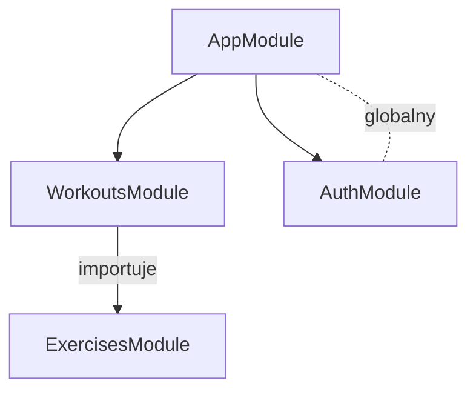

# IRONLOG - Architektura modułów

## Graf zależności

## Moduły

### ExercisesModule
Zarządzanie definicjami ćwiczeń (CRUD). Niezależny — nie importuje innych feature modules.

### WorkoutsModule
Treningi (WorkoutLog) + serie (WorkoutSet) + draft aktywnego treningu. Importuje ExercisesModule bo trening składa się z ćwiczeń.

### AuthModule
Rejestracja, login, JWT. Działa globalnie — nie jest importowany przez poszczególne moduły.

## Uzasadnienie podziału
- Exercise istnieje niezależnie od treningu, trening bez ćwiczeń nie ma sensu → osobne moduły, jednokierunkowa zależność
- WorkoutLog + WorkoutSet + draft w jednym module bo są ściśle powiązane
- Auth globalny bo każdy endpoint potrzebuje weryfikacji usera
- Brak cykli w grafie zależności
